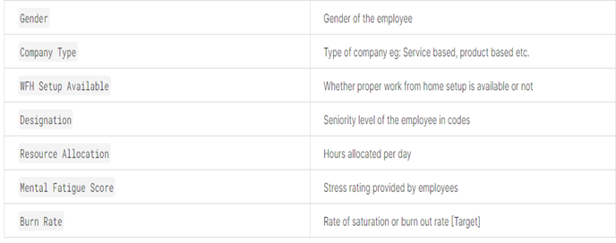
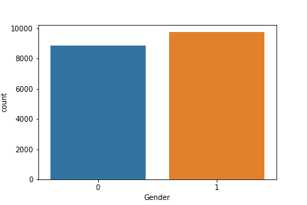
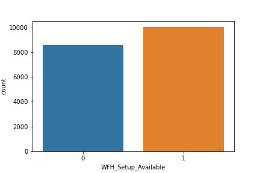
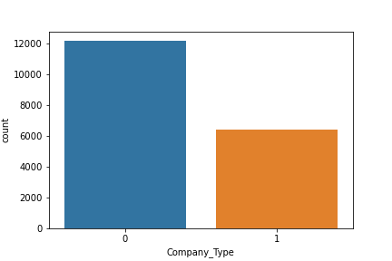

# Employee-Burnout
This is a machine learning project that predicts employee burnout rate. Since the pandemic, employers have noticed an alarming amount of their employees becoming burnout at work. Burnout can be best described as the physical or mental exhaustion of an individual.  HackerEarth provided a train and test dataset in Kaggle that will allow machine learning engineers predict burnout rate. Several variables were presented to use, to build the machine learning model. I used the following variables in my machine learning model:

The first step of this project was to import the train.csv file into pandas which are displayed in the employee_burnout.ipnyb file located in the Sharice folder.
## Data Analysis
Below are graphs made with matiplot and seaborn to analyze the data that is in the train.csv.
In addition, variables such as Gender, Company Type, and WFH Setup Available values were turned into binary.
#### Gender Count 
- This graph depicts the count of male and females that have participated in this dataset:
- 

#### Work From Home Setup
- This bar chart shows how many employees can work from home:
- 

#### Company Type
- This bar chart counts the number of employees who work in product vs service companies:
- 

#### Mental Fatigue Score
- This chart showcase the range of employee Mental Fatigue:
- 
## Data Prediction Model

#### Building the Model
I am using Linear Regression as the machine learning model to predict employee burnout rate.
After training the model in pandas I have to do pickle.dump command to serialize objects so they can be saved to a file, and Loaded in a program again later on.
